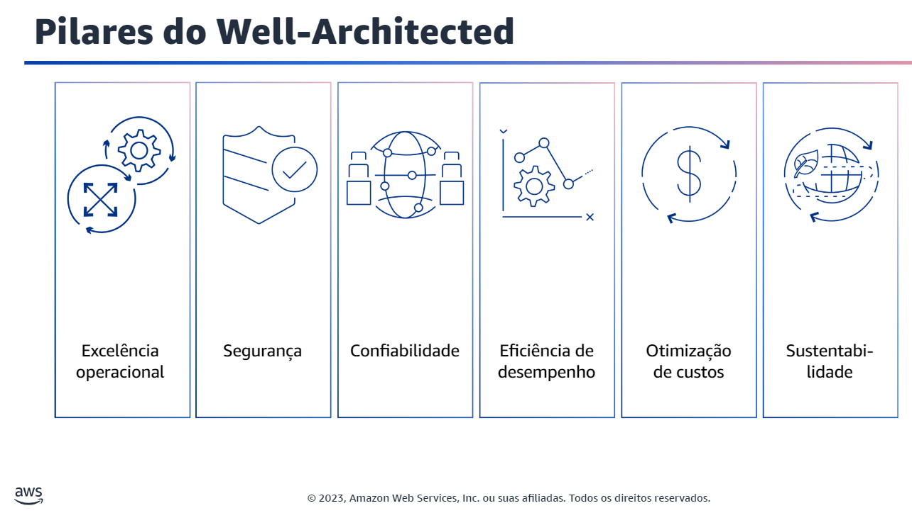

 # Um Guia de preparação para a Prova

 - [ AWS Well-Architected Framework](#aws-well-architected-framework).

---
---

# AWS Well-Architected Framework

AWS Well-Architected ajuda arquitetos de nuvem a construir infraestruturas seguras, resilientes, eficientes e de alta performance para aplicações e workloads. Baseado em seis pilares (excelência operacional, segurança, confiabilidade, eficiência de performance, otimização de custos e sustentabilidade), o AWS Well-Architected fornece uma abordagem consistente para que clientes e parceiros avaliem arquiteturas e implementem designs que podem se expandir com o tempo.

- <strong>Pilar 1: Excelência operacional</strong>
                          
 O pilar Excelência operacional se concentra na execução e monitoramento sistemas e na melhoria contínua de processos e procedimentos. Os principais tópicos incluem automação de alterações, reação a eventos e definição de padrões para gerenciar as operações diárias.
         
- <strong>Pilar 2: Segurança</strong>

 O pilar Segurança se concentra na proteção de informações e sistemas. Os principais tópicos incluem confidencialidade e integridade de dados, gerenciamento de permissões de usuário e estabelecimento de controles para detectar eventos de segurança.

- <strong>Pilar 3: Confiabilidade</strong>

 O pilar da confiabilidade se concentra nos workloads que executam as funções pretendidas e na recuperação rápida de falhas em atender demandas. Os principais tópicos incluem projeto de sistemas distribuídos, planejamento de recuperação e requisitos adaptação a mudanças.

- <strong>Pilar 4: Eficiência de performance</strong>

 O pilar de eficiência de performance se concentra na alocação estruturada e simplificada de recursos de TI e computação. Os principais tópicos incluem seleção dos tipos e tamanhos certos dos recursos otimizados para os requisitos de workload, monitoramento de performance e manutenção da eficiência à medida que as necessidades comerciais evoluem.

- <strong>Pilar 5: Otimização de custos</strong>

 O pilar de otimização de custos se concentra em evitar custos desnecessários. Os principais tópicos incluem compreensão dos gastos ao longo do tempo e controle da alocação de fundos, seleção do tipo e quantidade certa de recursos e dimensionamento para atender às necessidades de negócios sem gastos excessivos.

- <strong>Pilar 6: Sustentabilidade</strong>

 O pilar de sustentabilidade se concentra em minimizar os impactos ambientais da execução de workloads em nuvem. Os principais tópicos incluem um modelo de responsabilidade compartilhada para sustentabilidade, compreensão do impacto e maximização da utilização para minimizar os recursos necessários e reduzir os impactos posteriores. 

---
---
