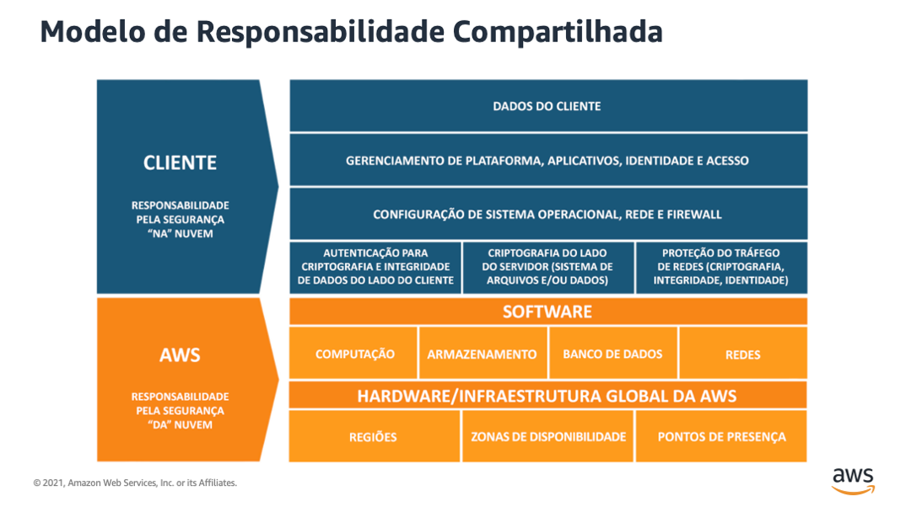

 # Um Guia de preparação para Certificação AWS Cloud Practitioner (CLF‐C02)

 - [Você sabe o que é Cloud Computing?](#você-sabe-o-que-é-cloud-computing?)
 - [Computação em nuvem com a AWS](#computação-em-nuvem-com-a-aws) 
 - [A Estrutura da AWS](#a-estrutura-da-aws)
 - [AWS Well-Architected Framework](#aws-well-architected-framework)

---
---
# Você sabe o que é Cloud computing?

Cloud computing (computação em nuvem) é um modelo de entrega de serviços de tecnologia da informação (TI) que permite o acesso on-demand a recursos computacionais, como servidores, armazenamento, bancos de dados, redes, software e outros serviços, pela internet. Esses recursos são fornecidos por provedores de nuvem e podem ser escalados e gerenciados de forma flexível e sob demanda.

**Principais características do cloud computing:**

 - **On-Demand Self-Service:** Usuários podem provisionar recursos de computação conforme necessário, sem intervenção direta do provedor de serviços.

 - **Broad Network Access:** Serviços são acessíveis através de redes e dispositivos variados, como desktops, laptops, tablets e smartphones.

 - **Resource Pooling:** Recursos de computação são agrupados para atender a múltiplos consumidores, com diferentes recursos físicos e virtuais alocados dinamicamente conforme a demanda.

 - **Rapid Elasticity:** Recursos podem ser escalados rapidamente para acomodar a demanda crescente ou diminuída.

 - **Measured Service:** Recursos são monitorados, controlados e relatados para proporcionar transparência sobre o uso e os custos associados.

**Modelos de serviço na nuvem:**

 - **Infraestrutura como Serviço (IaaS):** Fornece infraestrutura de TI básica, como máquinas virtuais, armazenamento e redes. Exemplos: Amazon EC2, Google Compute Engine.

 - **Plataforma como Serviço (PaaS):** Oferece uma plataforma para o desenvolvimento e gerenciamento de aplicativos sem se preocupar com a infraestrutura subjacente. Exemplos: Google App Engine, Microsoft Azure App Services.

 - **Software como Serviço (SaaS):** Fornece aplicativos prontos para uso, acessíveis via web. Exemplos: Google Workspace, Microsoft Office 365.

**Modelos de implantação na nuvem:**

 - **Nuvem Pública:** Recursos são fornecidos e gerenciados por um provedor externo e compartilhados entre múltiplos clientes. Exemplos: Amazon Web Services (AWS), Microsoft Azure.

 - **Nuvem Privada:** Recursos são dedicados a uma única organização e podem ser gerenciados internamente ou por um provedor externo.

 - **Nuvem Híbrida:** Combina nuvens públicas e privadas, permitindo que dados e aplicativos sejam compartilhados entre elas.

 - **Nuvem Comunitária:** Compartilhada por várias organizações com interesses comuns, como segurança ou conformidade.

O uso da computação em nuvem oferece vantagens como escalabilidade, flexibilidade, custo reduzido e maior agilidade na implementação e gerenciamento de recursos de TI

---
---
# Computação em nuvem com a AWS

A Amazon Web Services (AWS) é a plataforma de nuvem mais adotada e mais abrangente do mundo, oferecendo mais de 200 serviços completos de datacenters em todo o mundo. Milhões de clientes, incluindo as startups que crescem mais rápido, as maiores empresas e os maiores órgãos governamentais, estão usando a AWS para reduzir custos, ganhar agilidade e inovar mais rapidamente.

 - **Funcionalidade máxima**

A AWS oferece uma quantidade consideravelmente maior de serviços – e mais recursos com esses serviços – do que qualquer outro provedor de nuvem: de tecnologias de infraestrutura, como computação, armazenamento e bancos de dados, a tecnologias emergentes como machine learning e inteligência artificial, data lakes, análises e Internet das Coisas. Com isso, é mais rápido, mas fácil e mais econômico mover seus aplicativos para a nuvem e construir praticamente qualquer coisa que você possa imaginar.

A AWS também tem a funcionalidade mais aprofundada nesses serviços. Por exemplo, a AWS oferece a mais ampla gama de bancos de dados especialmente criados para os diversos tipos de aplicativos. Assim, você pode escolher a ferramenta certa para o trabalho, ao melhor custo e com a melhor performance.

 - **Mais seguro**

A AWS foi projetada para ser um dos ambientes de computação em nuvem mais flexíveis e seguros atualmente disponíveis. Nossa infraestrutura central foi criada para satisfazer aos requisitos de segurança militares, de bancos globais e de outras organizações que lidam com informações altamente confidenciais. Isso é respaldado por um conjunto avançado de ferramentas de segurança de nuvem, com mais de 300 recursos essenciais e serviços de segurança, conformidade e governança, além do suporte a 143 normas de segurança e certificações de conformidade.

 - **O ritmo de inovação mais acelerado**

Com a AWS, você pode utilizar as últimas tecnologias para conduzir testes e inovar mais rapidamente. Estamos sempre inovando a um ritmo cada vez mais acelerado para criar tecnologias completamente novas que você pode usar para transformar seus negócios. Por exemplo, em 2014, a AWS abriu o espaço de computação sem servidor com o lançamento do AWS Lambda, que permite que desenvolvedores executem códigos sem provisionar nem gerenciar servidores. E a AWS construiu o Amazon SageMaker, um serviço completamente gerenciado de machine learning que permite que desenvolvedores e cientistas usem essa tecnologia sem qualquer experiência anterior.

 - **O conhecimento operacional mais comprovado**

A AWS tem experiência, maturidade, confiabilidade, segurança e performance incomparáveis nas quais você pode confiar para suas aplicações mais importantes. Há mais de 17 anos, a AWS entrega serviços de nuvem a milhões de clientes no mundo inteiro, administrando uma grande variedade de casos de uso. Além disso, a AWS possui a maior experiência operacional e em maior escala do que qualquer outro provedor de nuvem.

---
---
# A Estrutura da AWS
### Infraestrutura global da AWS
    
A infraestrutura global da AWS é a base sobre a qual os serviços da AWS são construídos. Ela consiste em uma série de Regiões e Zonas de Disponibilidade espalhadas pelo mundo, projetadas para fornecer um serviço seguro, confiável e escalável.

1. **Regiões**: Uma região da AWS é uma área geográfica que contém pelo menos duas Zonas de Disponibilidade. Cada região é completamente independente das outras regiões, o que ajuda a isolar falhas e evitar a propagação de problemas de uma região para outra. Em setembro de 2021, a AWS tinha 25 regiões geográficas ao redor do mundo.

2. **Zonas de Disponibilidade (AZs)**: Cada região da AWS é dividida em Zonas de Disponibilidade. Cada AZ é um centro de dados separado dentro de uma região, mas todas as AZs dentro de uma região estão conectadas através de redes de alta velocidade, de baixa latência e totalmente redundantes. As AZs fornecem uma maneira de construir aplicativos altamente disponíveis e tolerantes a falhas.

3. **Zonas Locais**: As zonas locais da AWS aproximam a computação, o armazenamento, o banco de dados e outros produtos da AWS selecionados dos usuários finais. Com as zonas locais da AWS, você pode executar facilmente aplicativos altamente exigentes que exigem latências em milissegundos de um dígito para seus usuários finais, como criação de conteúdo de mídia e entretenimento, jogos em tempo real, simulações de reservatórios, automação de projetos eletrônicos e machine learning.

4. **Wavelenght**: O AWS Wavelength permite que os desenvolvedores criem aplicações com latências de um dígito para dispositivos móveis e usuários finais. Os desenvolvedores da AWS podem implantar seus aplicativos nas Zonas do Wavelength, implantações de infraestrutura da AWS que incorporam serviços de computação e armazenamento da AWS aos datacenters dos provedores de telecomunicações na borda das redes 5G e acessam facilmente a variedade de serviços da AWS na região. Isso permite que os desenvolvedores forneçam aplicativos que exigem latências inferiores a 10 milissegundos, como streaming de jogos e vídeos ao vivo, inferência de machine learning na borda e realidade aumentada e virtual (AR/VR).

5. **OutPosts:** O AWS Outposts leva produtos, infraestrutura e modelos operacionais nativos da AWS a praticamente qualquer datacenter, espaço de colocalização ou instalações on-premises. Você pode usar as mesmas APIs, ferramentas e infraestrutura da AWS no local e na Nuvem AWS para oferecer uma experiência híbrida verdadeiramente consistente. O AWS Outposts foi projetado para ambientes conectados e pode ser usado para oferecer suporte a workloads que precisam permanecer on-premises devido à baixa latência ou às necessidades de processamento de dados locais.

A infraestrutura global da AWS permite que os usuários implantem seus aplicativos e serviços de maneira flexível, resiliente e eficiente em termos de latência, onde quer que seus clientes estejam localizados no mundo. Isso significa que, como usuário da AWS, você pode oferecer uma experiência de usuário mais rápida e melhor para seus clientes, independentemente de sua localização geográfica.

### AWS Share Responsibility Model
    
O Modelo de Responsabilidade Compartilhada da AWS é uma estrutura de governança que delineia a divisão de responsabilidades de segurança entre a Amazon Web Services (AWS) e o usuário (cliente). Essa divisão de responsabilidades permite que a AWS se concentre na segurança da infraestrutura de computação em nuvem, enquanto o usuário se concentra na segurança dos dados e recursos que colocam na nuvem. Aqui está uma visão geral das responsabilidades compartilhadas:

1. **Segurança "da" nuvem**: A AWS é responsável pela proteção da infraestrutura que executa todos os serviços oferecidos na AWS Cloud. Isso inclui hardware, software, redes e instalações que sustentam os serviços AWS Cloud.

2. **Segurança "na" nuvem**: O cliente é responsável pela segurança de qualquer coisa que coloque "na" nuvem ou conecte "à" nuvem. Isso pode incluir a configuração correta de controles de segurança e conformidade em serviços da AWS, gerenciamento de dados (incluindo criptografia e backups), classificação de ativos e outras várias tarefas de segurança de TI.

3. **Serviços de Infraestrutura, Contêiner e Abstração**: Dependendo do tipo de serviço da AWS que está sendo usado (por exemplo, uma instância EC2 versus um banco de dados RDS), a AWS e o cliente compartilharão diferentes partes da responsabilidade de segurança. Por exemplo, para um serviço de infraestrutura como o EC2, a AWS fornece a segurança física, a do hypervisor e a da rede, enquanto o cliente é responsável pelo sistema operacional e pelas aplicações. Para um serviço de contêiner como o RDS, a AWS também é responsável pela segurança do sistema operacional e do serviço de banco de dados, enquanto o cliente ainda é responsável pelas aplicações e dados.

A compreensão e a aplicação adequada do Modelo de Responsabilidade Compartilhada da AWS são fundamentais para garantir a segurança e a conformidade ao usar a AWS. Isso requer que os clientes estejam cientes de suas responsabilidades de segurança e implementem práticas de segurança robustas ao usar serviços da AWS.

---
---
# AWS Well-Architected Framework

AWS Well-Architected ajuda arquitetos de nuvem a construir infraestruturas seguras, resilientes, eficientes e de alta performance para aplicações e workloads. Baseado em seis pilares (excelência operacional, segurança, confiabilidade, eficiência de performance, otimização de custos e sustentabilidade), o AWS Well-Architected fornece uma abordagem consistente para que clientes e parceiros avaliem arquiteturas e implementem designs que podem se expandir com o tempo.

- <strong>Pilar 1: Excelência operacional</strong>
                          
 O pilar Excelência operacional se concentra na execução e monitoramento sistemas e na melhoria contínua de processos e procedimentos. Os principais tópicos incluem automação de alterações, reação a eventos e definição de padrões para gerenciar as operações diárias.
         
- <strong>Pilar 2: Segurança</strong>

 O pilar Segurança se concentra na proteção de informações e sistemas. Os principais tópicos incluem confidencialidade e integridade de dados, gerenciamento de permissões de usuário e estabelecimento de controles para detectar eventos de segurança.

- <strong>Pilar 3: Confiabilidade</strong>

 O pilar da confiabilidade se concentra nos workloads que executam as funções pretendidas e na recuperação rápida de falhas em atender demandas. Os principais tópicos incluem projeto de sistemas distribuídos, planejamento de recuperação e requisitos adaptação a mudanças.

- <strong>Pilar 4: Eficiência de performance</strong>

 O pilar de eficiência de performance se concentra na alocação estruturada e simplificada de recursos de TI e computação. Os principais tópicos incluem seleção dos tipos e tamanhos certos dos recursos otimizados para os requisitos de workload, monitoramento de performance e manutenção da eficiência à medida que as necessidades comerciais evoluem.

- <strong>Pilar 5: Otimização de custos</strong>

 O pilar de otimização de custos se concentra em evitar custos desnecessários. Os principais tópicos incluem compreensão dos gastos ao longo do tempo e controle da alocação de fundos, seleção do tipo e quantidade certa de recursos e dimensionamento para atender às necessidades de negócios sem gastos excessivos.

- <strong>Pilar 6: Sustentabilidade</strong>

 O pilar de sustentabilidade se concentra em minimizar os impactos ambientais da execução de workloads em nuvem. Os principais tópicos incluem um modelo de responsabilidade compartilhada para sustentabilidade, compreensão do impacto e maximização da utilização para minimizar os recursos necessários e reduzir os impactos posteriores. 

---
---
